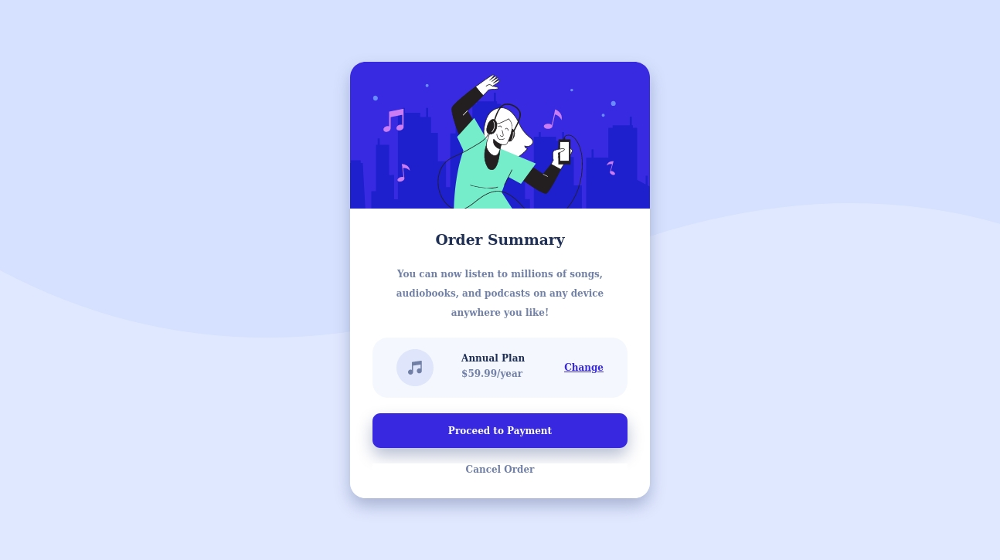

# Frontend Mentor - QR code component solution

This is a solution to the [QR code component challenge on Frontend Mentor](https://www.frontendmentor.io/challenges/qr-code-component-iux_sIO_H). Frontend Mentor challenges help you improve your coding skills by building realistic projects. 

## Table of contents

- [Overview](#overview)
  - [Screenshot](#screenshot)
  - [Links](#links)
- [My process](#my-process)
  - [Built with](#built-with)
  - [What I learned](#what-i-learned)
  - [Continued development](#continued-development)
  - [Useful resources](#useful-resources)
- [Author](#author)
- [Acknowledgments](#acknowledgments)

**Note: Delete this note and update the table of contents based on what sections you keep.**

## Overview

### Screenshot



### Links

- Solution URL:https://github.com/pbgo2/pbgo2.github.io.git 
- Live Site URL: https://pbgo2.github.io/ 

## My process

### Built with

- Semantic HTML5 markup
- CSS custom properties
- Flexbox
- Mobile-first workflow

### What I learned

```css
    /* Mobile Styles */
    @media only screen and (min-width: 1px) and (max-width: 375px)  {
      .container{
      display: flex;
      flex-direction: column;
      justify-content: center;
      align-items: center;
      margin: 50px auto;
      }
      svg {
        height: max(40px, 5vh);
        width: max(64px, 5vw);
      }
      .sedans{
        border-radius: 10px 10px 0 0;
      }
      .luxury{
        border-radius: 0 0 10px 10px;
      }
    }

    /* Tablet Styles -Desktop Styles*/
    @media only screen and (min-width: 401px) and (max-width: 1440px) {
      .container{
      display: flex;
      flex-direction: row;
      justify-content: center;
      align-items: center;
      width: 70vw;
      height: 100vh;
      margin: 10px auto;
      padding: 90px 50px;
      }
      svg {
        height: max(40px, 5vh);
        width: max(64px, 5vw);
      }
      .sedans{
        border-radius: 10px 0 0 10px;
      }
      .luxury{
        border-radius: 0 10px 10px 0;
      }
    }
```

### Continued development

### Useful resources
- Family: [Outfit](https://fonts.google.com/specimen/Outfit)

## Author

## Acknowledgments
